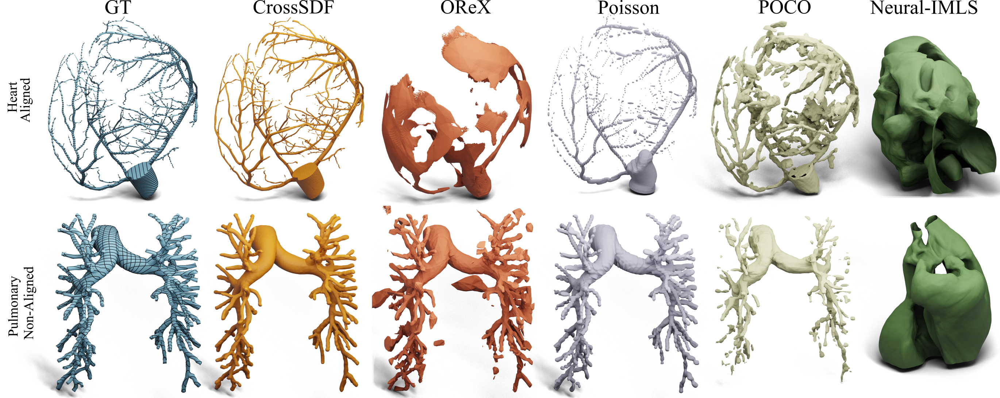

# CrossSDF: 3D Reconstruction of Thin Structures from Cross-Sections

## Disclaimer

The CrossSDF algorithm can be used for non-commercial research and is licensed under the license found in LICENSE.

## Dataset Overview

### Thin-Structure Dataset

The thin structures dataset consists of six meshes originally created for fluid and solid mechanics evaluation. These models were sourced from the Vascular Model Repository (VMR), a publicly available resource of image-based vascular geometries used in validated CFD and FSI simulations. Each mesh comprises detailed tubular, branching structures. 

These include:

- `heart.stl` — full cardiac mesh
- `pulmonary_vascular_tree.stl` — complete branching lung vasculature
- `pulmonary_arteries.stl` — major pulmonary arterial segments
- `cerebral_arteries.stl` — circle of Willis and cerebral vasculature
- `coronary_arteries_v1.stl` and `coronary_arteries_v2.stl` — variations of coronary artery mesh topology

These models are used to benchmark CrossSDF on fine, tubular geometries typical of anatomical networks, and are reconstructed from sets of parallel and random planar cross-sections.

### Thick-Structure Dataset

To evaluate generalizability beyond vascular structures, we also test CrossSDF on thicker objects. This benchmark includes five classic geometric models and one brain model:

- `armadillo.stl`, `brain.stl`, `eight.stl`, `mammoth.stl`, `ok.stl`, and `hand.stl`

These meshes are sourced from the open-access dataset introduced in OReX ([Sawdayee et al., 2023](https://arxiv.org/abs/2211.12886)).

### Real CT Scan Datasets

To validate CrossSDF on real medical data, we include segmentation-derived meshes from two widely-used datasets:

- **IRCADb-01**: Contains 20 contrast-enhanced abdominal CT scans with fully manual segmentations of liver vascular structures. Available at [ircad.fr](https://www.ircad.fr/research/3d-ircadb-01/).
- **Medical Segmentation Decathlon (MSD)**: Task 08 (Hepatic Vessels) includes 443 portal-phase CT scans with expert-annotated hepatic veins and arteries. Accessible at [medicaldecathlon.com](http://medicaldecathlon.com/).

These datasets allow assessment of our method’s performance on noisy, low-resolution, and anatomically varied data derived from real-world imaging.

## Citation

If you use the CrossSDF in your work, please cite the following [paper](https://www.arxiv.org/abs/2412.04120):

```bibtex
@inproceedings{walker2025_crosssdf,
    author = {Walker, Thomas and Esposito, Salvatore and Rebain, Daniel and Vaxman, Amir and Onken, Arno and Li, Changjian and Mac Aodha, Oisin},
    title = {CrossSDF: 3D Reconstruction of Thin Structures from Cross-Sections},
    booktitle = {Proceedings of the IEEE/CVF Conference on Computer Vision and Pattern Recognition},
    year = {2025},
}
```