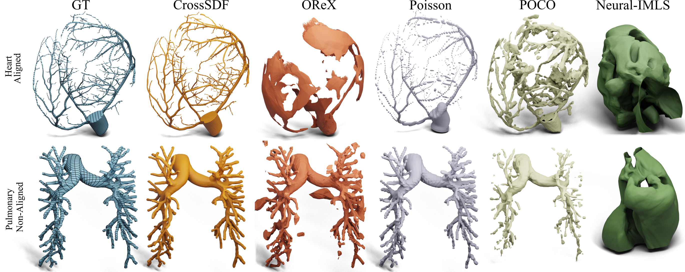

# CrossSDF: 3D Reconstruction of Thin Structures from Cross-Sections

[](LICENSE)
[](https://www.arxiv.org/abs/2412.04120)
[](https://cvpr.thecvf.com/)
[](https://iamsalvatore.github.io/cross_sdf/)



**CrossSDF** is a novel method for 3D reconstruction of thin structures from cross-sectional data. This repository contains the **dataset** used for evaluation in our CVPR 2025 paper.

## 🎬 Results & Demos

Visit our **[project website](https://iamsalvatore.github.io/cross_sdf/)** to see:
- **Interactive video comparisons** of CrossSDF vs. other methods
- **Method overview** and technical details
- **Training progress visualization**
- **Qualitative results** on medical structures

## 📋 Table of Contents

- [Results & Demos](#-results--demos)
- [Dataset Overview](#-dataset-overview)
- [Data Format](#-data-format)
- [Download and Usage](#-download-and-usage)
- [Benchmarking](#-benchmarking)
- [Citation](#-citation)
- [License](#-license)
- [Contact](#-contact)

## 📊 Dataset Overview

Our dataset consists of **18 high-quality 3D meshes** organized into two categories for comprehensive evaluation of 3D reconstruction methods on both thin and thick structures.

### Thin Structures Dataset

The thin structures dataset contains **6 meshes** featuring complex tubular and branching geometries, ideal for evaluating reconstruction of fine anatomical networks:

| Mesh | Description | Source |
|------|-------------|---------|
| `heart.stl` | Complete cardiac mesh | [Vascular Model Repository](https://www.vascularmodel.org/) |
| `pulmonary_vascular_tree.stl` | Full branching lung vasculature | VMR |
| `pulmonary_arteries.stl` | Major pulmonary arterial segments | VMR |
| `cerebral_arteries.stl` | Circle of Willis and cerebral vasculature | VMR |
| `coronary_arteries_v1.stl` | Coronary artery topology (variant 1) | VMR |
| `coronary_arteries_v2.stl` | Coronary artery topology (variant 2) | VMR |

### Thick Structures Dataset

The thick structures dataset includes **6 meshes** for evaluating generalizability beyond vascular structures:

| Mesh | Description | Source |
|------|-------------|---------|
| `armadillo.stl` | Armadillo model | [OReX Dataset](https://arxiv.org/abs/2211.12886) |
| `brain.stl` | Brain surface mesh | OReX Dataset |
| `eight.stl` | Figure-eight topology | OReX Dataset |
| `hand.stl` | Human hand model | OReX Dataset |
| `mammoth.stl` | Mammoth model | OReX Dataset |
| `ok.stl` | OK hand gesture | OReX Dataset |

### Additional Real-World Datasets

For validation on real medical data, we also utilize:

- **[IRCADb-01](https://www.ircad.fr/research/data-sets/)**: 20 contrast-enhanced abdominal CT scans with manual liver vascular segmentations
- **[Medical Segmentation Decathlon](http://medicaldecathlon.com/)**: Task 08 with 443 portal-phase CT scans and hepatic vessel annotations

## 🔧 Data Format

All meshes are provided in **STL format** with the following specifications:

- **Format**: Binary STL files
- **Coordinate System**: All meshes are **normalized to the range [-1, 1]** in all three dimensions
- **Units**: Dimensionless (normalized coordinates)
- **Orientation**: Consistent across all models
- **Quality**: High-resolution meshes suitable for research and benchmarking

### File Structure

```
cross_sdf/
├── data/
│   ├── thin_structures/          # Thin/tubular geometries
│   │   ├── heart.stl
│   │   ├── pulmonary_vascular_tree.stl
│   │   ├── pulmonary_arteries.stl
│   │   ├── cerebral_arteries.stl
│   │   ├── coronary_arteries_v1.stl
│   │   └── coronary_arteries_v2.stl
│   └── thick_structures/         # Thick/solid geometries
│       ├── armadillo.stl
│       ├── brain.stl
│       ├── eight.stl
│       ├── hand.stl
│       ├── mammoth.stl
│       └── ok.stl
├── assets/
│   ├── images/                   # Figures and visualizations
│   └── videos/                   # Comparison videos
├── README.md
├── LICENSE
└── CITATION.cff
```

## 📥 Download and Usage

### Clone Repository

```bash
git clone https://github.com/iamsalvatore/cross_sdf.git
cd cross_sdf
```

### Loading STL Files

The meshes can be loaded using any standard 3D processing library:

**Python (using trimesh):**
```python
import trimesh

# Load a thin structure
mesh = trimesh.load('data/thin_structures/heart.stl')
print(f"Vertices: {len(mesh.vertices)}, Faces: {len(mesh.faces)}")
```

**Python (using Open3D):**
```python
import open3d as o3d

# Load a thick structure
mesh = o3d.io.read_triangle_mesh('data/thick_structures/armadillo.stl')
mesh.compute_vertex_normals()
o3d.visualization.draw_geometries([mesh])
```

**MATLAB:**
```matlab
% Load mesh
mesh = stlread('data/thin_structures/pulmonary_vascular_tree.stl');
```

## 🏆 Benchmarking

This dataset is designed for evaluating 3D reconstruction methods, particularly those dealing with:

- **Cross-sectional reconstruction** from parallel or random planar cuts
- **Thin structure preservation** in tubular and branching geometries
- **Multi-scale geometry handling** from fine vessels to solid objects
- **Robustness to noise** and incomplete data

### Evaluation Metrics

Common metrics for benchmarking include:
- Chamfer Distance (CD)
- Hausdorff Distance
- Normal Consistency
- Volume Preservation
- Surface Quality Metrics

## 📖 Citation

If you use this dataset in your research, please cite our paper:

```bibtex
@inproceedings{walker2025_crosssdf,
    author = {Walker, Thomas and Esposito, Salvatore and Rebain, Daniel and Vaxman, Amir and Onken, Arno and Li, Changjian and Mac Aodha, Oisin},
    title = {CrossSDF: 3D Reconstruction of Thin Structures from Cross-Sections},
    booktitle = {Proceedings of the IEEE/CVF Conference on Computer Vision and Pattern Recognition},
    year = {2025},
}
```

## 📄 License

This dataset is released under a custom license for **non-commercial research use only**. See [LICENSE](LICENSE) for full details.

## 📧 Contact

For questions about the dataset or paper, please contact:

- **Salvatore Esposito** - [salvatore.esp95@gmail.com](mailto:salvatore.esp95@gmail.com)
- **Thomas Walker** - [thomas.walker@ed.ac.uk](mailto:thomas.walker@ed.ac.uk)

## 🙏 Acknowledgments

We thank the creators of the [Vascular Model Repository](https://www.vascularmodel.org/) and the [OReX Dataset](https://arxiv.org/abs/2211.12886) for making their high-quality 3D models publicly available.

---

<p align="center">
  
</p>